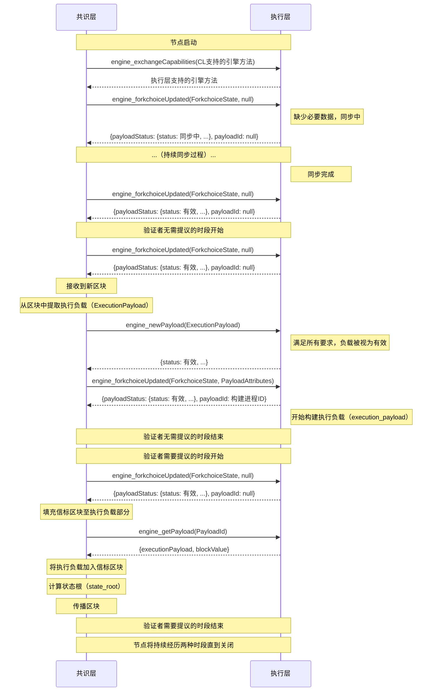
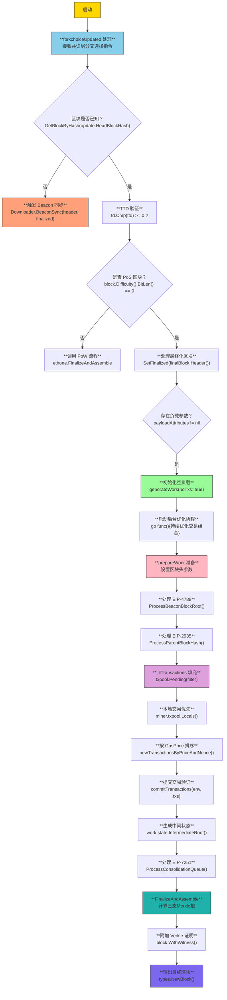

# go-ethereum源码剖析:你的交易是如何上链的

> 前文我们讲到geth会通过会通过反射注册各个接口来供给外部访问,这些接口包含了区块链基础设施供应商例如ankr、alchemy、infura等支持的ethereum访问的基础rpc方法(当然，不排除会通过扩展geth来向用户提供更多方法)。一般的基于ethereum的layer2 例如optimism都依赖于geth client。

在绝大多数用户访问区块链网络的媒介都是通过钱包，从最初的metamask到现在的okx wallet、phantom以及更多类型的evm系钱包都是通过与区块链系统的rpc接口进行交互和联系，其中讨论的最多的可能就是如何向以太坊网络发送一笔交易。


ethereum 原生rpc支持两种方式产生一笔交易分别为
+ func (api *TransactionAPI) SendTransaction(ctx context.Context, args TransactionArgs) (common.Hash, error)
+ func (api *TransactionAPI) SendRawTransaction(ctx context.Context, input hexutil.Bytes) (common.Hash, error)

第一种方式要求发送交易的账户已经在account manager进行注册并且解锁，你需要值得注意的是，这个方法是原则上存在安全性行为，默认geth 只允许localhost访问，如果你是以太坊的基础设施供应商，那么你不应该在account manager解锁任意账户，因为这允许外部用户直接通过调用rpc方法无须签名来发送一笔交易。

钱包都是通过第二种方式来发送,这需要用户提前对交易进行签名来验证账户的拥有权。


我这里通过第一种方式来对发送一笔交易的具体细节进行讲解，因为这种方式更加详细。
```go

// TransactionArgs represents the arguments to construct a new transaction
// or a message call.
type TransactionArgs struct {
    From     *common.Address `json:"from"`
    To       *common.Address `json:"to"`
    Gas      *hexutil.Uint64 `json:"gas"`
    GasPrice *hexutil.Big    `json:"gasPrice"`
    //EIP 1559协议规定，用户可以调整愿意为这比交易多付出的消费。MaxFeePerGas >= (GasPrices + MaxPriorityFeePerGas)
    MaxFeePerGas *hexutil.Big `json:"maxFeePerGas"`
    //priority_fee_per_gas = min(transaction.max_priority_fee_per_gas, transaction.max_fee_per_gas - block.base_fee_per_gas)
    MaxPriorityFeePerGas *hexutil.Big `json:"maxPriorityFeePerGas"`
    //需要转移的原生代币数量
    Value *hexutil.Big `json:"value"`
    //防止重放攻击
    Nonce *hexutil.Uint64 `json:"nonce"`

    // We accept "data" and "input" for backwards-compatibility reasons.
    // "input" is the newer name and should be preferred by clients.
    // Issue detail: https://github.com/ethereum/go-ethereum/issues/15628
    //Data 是旧版字段，Input 是新版字段，二者等效
    Data  *hexutil.Bytes `json:"data"`
    Input *hexutil.Bytes `json:"input"`

    // Introduced by AccessListTxType transaction.
    //在以太坊中，访问storage状态是需要消费巨量gas的，在eip150以及eip1884的提案下，sload的成本从50->800,在图灵完备的evm中，因为逻辑的不同可能会导致gas费难以预测，accesslist相当于cache的作用
    //在执行交易前告诉ethereum需要频繁访问的地址，以免sload导致的巨量gas而造成over gas limit的交易存在
    AccessList *types.AccessList `json:"accessList,omitempty"`
    ChainID    *hexutil.Big      `json:"chainId,omitempty"`

    // For BlobTxType
    // blob类交易主要是为了ethereum layer2进行扩展。在没有eip4844之前,layer2方案是将数据存储在calldata中,但是这个方案因为gas limit的存在导致layer2一次性不能向ethereum发送太多数据。这未能释放layer2的全部潜力
    BlobFeeCap *hexutil.Big  `json:"maxFeePerBlobGas"`
    BlobHashes []common.Hash `json:"blobVersionedHashes,omitempty"`

    // For BlobTxType transactions with blob sidecar
    //单笔blob交易能够携带1-4个blob每个blob的容量为125kb，大约131072个字节
    // blob对于每字节消耗的gas有单独的计算规则，大约是1gas/字节，成本平均比calldata的方式下降16倍。同时blob数据仅在full node中保留4096个epoch，大约18天
    Blobs       []kzg4844.Blob       `json:"blobs"`
    //ethereum 利用kzg承诺来进行零知识证明，其数学逻辑是基于双线性映射进行构造(有趣的是bls多签也是基于双线性映射进行构造)
    Commitments []kzg4844.Commitment `json:"commitments"`
    Proofs      []kzg4844.Proof      `json:"proofs"`

    // This configures whether blobs are allowed to be passed.
    //因为blob数据的分发会影响网络带宽，为保证p2p网络的安全性，blob数据并不直接写入区块，而是通过节点p2p网络进行分发
    blobSidecarAllowed bool
}

```


```go

// SendTransaction creates a transaction for the given argument, sign it and submit it to the
// transaction pool.
func (api *TransactionAPI) SendTransaction(ctx context.Context, args TransactionArgs) (common.Hash, error) {
    // 这种方式会验证交易发送者是否在本地的account manager并且已经解锁
    account := accounts.Account{Address: args.from()}

    wallet, err := api.b.AccountManager().Find(account)
    if err != nil {
        return common.Hash{}, err
    }
    if args.Nonce == nil {
        // Hold the mutex around signing to prevent concurrent assignment of
        // the same nonce to multiple accounts.
        api.nonceLock.LockAddr(args.from())
        defer api.nonceLock.UnlockAddr(args.from())
    }
    //是否支持blob交易
    if args.IsEIP4844() {
        return common.Hash{}, errBlobTxNotSupported
    }

    // 这里面会检查并设置交易的默认值(如果args没有的话),有趣的是，如果是blob交易，那么他会帮助构造kzg承诺，如果感兴趣的话可以具体去看看如何实现，这里不做过多赘述
    if err := args.setDefaults(ctx, api.b, false); err != nil {
        return common.Hash{}, err
    }
    // 默认为legacy类型，在eip4844之后，transaction pool有了两大类交易，分别为legacy 和 blob ，默认交易为legacy transaction,其中legacy 又分为三类交易LegacyTxType、AccessListTxType、DynamicFeeTxType。DynamicFeeTxType对应由eip1559产生的矿工优先打包的交易,AccessListTxType为eip2930引入防止因过多sload导致的交易执行失败，同时能够让gas费尽可能可预测
    tx := args.ToTransaction(types.LegacyTxType)
    //这里因为account manager的wallet已经被手动解锁，所以可以直接进行签名
    signed, err := wallet.SignTx(account, tx, api.b.ChainConfig().ChainID)
    if err != nil {
        return common.Hash{}, err
    }
    return SubmitTransaction(ctx, api.b, signed)
}

```


```go

// SubmitTransaction is a helper function that submits tx to txPool and logs a message.
func SubmitTransaction(ctx context.Context, b Backend, tx *types.Transaction) (common.Hash, error) {
    // If the transaction fee cap is already specified, ensure the
    // fee of the given transaction is _reasonable_.
    if err := checkTxFee(tx.GasPrice(), tx.Gas(), b.RPCTxFeeCap()); err != nil {
        return common.Hash{}, err
    }
    //这里需要注明，在eip155中，为了防止不同链上的重放攻击，将签名的数据从(nonce, gasprice, startgas, to, value, data)设置为(nonce, gasprice, startgas, to, value, data, chainid, 0, 0)
    if !b.UnprotectedAllowed() && !tx.Protected() {
        // Ensure only eip155 signed transactions are submitted if EIP155Required is set.
        return common.Hash{}, errors.New("only replay-protected (EIP-155) transactions allowed over RPC")
    }
    //正式向交易池里面推送交易
    if err := b.SendTx(ctx, tx); err != nil {
        return common.Hash{}, err
    }
    // Print a log with full tx details for manual investigations and interventions
    head := b.CurrentBlock()
    signer := types.MakeSigner(b.ChainConfig(), head.Number, head.Time)
    from, err := types.Sender(signer, tx)
    if err != nil {
        return common.Hash{}, err
    }

    if tx.To() == nil {
        addr := crypto.CreateAddress(from, tx.Nonce())
        log.Info("Submitted contract creation", "hash", tx.Hash().Hex(), "from", from, "nonce", tx.Nonce(), "contract", addr.Hex(), "value", tx.Value())
    } else {
        log.Info("Submitted transaction", "hash", tx.Hash().Hex(), "from", from, "nonce", tx.Nonce(), "recipient", tx.To(), "value", tx.Value())
    }
    return tx.Hash(), nil
}

```


```go

func (b *EthAPIBackend) SendTx(ctx context.Context, signedTx *types.Transaction) error {
    //向交易池里面异步添加交易
    return b.eth.txPool.Add([]*types.Transaction{signedTx}, true, false)[0]
}


func (p *TxPool) Add(txs []*types.Transaction, local bool, sync bool) []error {
    //将transaction通过pool进行分类，分别交给pool执行
    txsets := make([][]*types.Transaction, len(p.subpools))
    splits := make([]int, len(txs))

    for i, tx := range txs {
        // Mark this transaction belonging to no-subpool
        splits[i] = -1

        // Try to find a subpool that accepts the transaction
        //这里面只有两种类型的sub pool,分别对应两类ethereum交易[]txpool.SubPool{legacyPool, blobPool}
        for j, subpool := range p.subpools {
            //查看交易是否满足类型需求
            if subpool.Filter(tx) {
                txsets[j] = append(txsets[j], tx)
                splits[i] = j
                break
            }
        }
    }
    // Add the transactions split apart to the individual subpools and piece
    // back the errors into the original sort order.
    //将交易放入对应的transaction pool
    errsets := make([][]error, len(p.subpools))
    for i := 0; i < len(p.subpools); i++ {
        errsets[i] = p.subpools[i].Add(txsets[i], local, sync)
    }
    errs := make([]error, len(txs))
    for i, split := range splits {
        // If the transaction was rejected by all subpools, mark it unsupported
        if split == -1 {
            errs[i] = fmt.Errorf("%w: received type %d", core.ErrTxTypeNotSupported, txs[i].Type())
            continue
        }
        // Find which subpool handled it and pull in the corresponding error
        errs[i] = errsets[split][0]
        errsets[split] = errsets[split][1:]
    }
    return errs
}

```

从上面来讲，ethereum会将交易按照类型放到不同的交易池里面执行，我们首先分析legacy交易池

```go
func (pool *LegacyPool) Add(txs []*types.Transaction, local, sync bool) []error {
    local = local && !pool.config.NoLocals

    // Filter out known ones without obtaining the pool lock or recovering signatures
    var (
        errs = make([]error, len(txs))
        news = make([]*types.Transaction, 0, len(txs))
    )
    for i, tx := range txs {
        // If the transaction is known, pre-set the error slot
        //根据交易hash判定该交易是否已经存在交易池，如果存在，那么会执行返回ErrAlreadyKnown错误。
        if pool.all.Get(tx.Hash()) != nil {
            errs[i] = txpool.ErrAlreadyKnown
            knownTxMeter.Mark(1)
            continue
        }
        // Exclude transactions with basic errors, e.g invalid signatures and
        // insufficient intrinsic gas as soon as possible and cache senders
        // in transactions before obtaining lock
        //验证交易是否基本有效,这里会检查签名是否正确，同时交易类型是否被当前ethereum版本支持。同时初步预测当前账户余额是否足够支付gas费，我个人认为大家可以去阅读一下IntrinsicGas(data []byte, accessList types.AccessList, isContractCreation, isHomestead, isEIP2028, isEIP3860 bool)方法，这个方法初步表达了gas费随input data大小的变化，值得关注的是，对于input零值和非零值的gas费是由巨大差别的，在eip2028之后，非零值为每字节16gas，零值为4gas。同时创建合约的交易基础费为53000，而普通交易为21000。对于eip3860,限制了init contract code的长度以及增添额外的费用
        if err := pool.validateTxBasics(tx, local); err != nil {
            errs[i] = err
            log.Trace("Discarding invalid transaction", "hash", tx.Hash(), "err", err)
            invalidTxMeter.Mark(1)
            continue
        }
        // Accumulate all unknown transactions for deeper processing
        news = append(news, tx)
    }
    if len(news) == 0 {
        return errs
    }

    // Process all the new transaction and merge any errors into the original slice
    pool.mu.Lock()
    newErrs, dirtyAddrs := pool.addTxsLocked(news, local)
    pool.mu.Unlock()

    var nilSlot = 0
    for _, err := range newErrs {
        for errs[nilSlot] != nil {
            nilSlot++
        }
        errs[nilSlot] = err
        nilSlot++
    }
    // 告知transaction pool在这期间变更的用户，这里是为了交易池发生重组后知晓哪些account的交易需要在交易池里面更新和删除
    done := pool.requestPromoteExecutables(dirtyAddrs)
    if sync {
        <-done
    }
    return errs
}

func (pool *LegacyPool) addTxsLocked(txs []*types.Transaction, local bool) ([]error, *accountSet) {
    dirty := newAccountSet(pool.signer)
    errs := make([]error, len(txs))
    for i, tx := range txs {
        replaced, err := pool.add(tx, local)
        errs[i] = err
        if err == nil && !replaced {
            dirty.addTx(tx)
        }
    }
    validTxMeter.Mark(int64(len(dirty.accounts)))
    return errs, dirty
}


func (pool *LegacyPool) add(tx *types.Transaction, local bool) (replaced bool, err error) {
    // If the transaction is already known, discard it
    hash := tx.Hash()
    if pool.all.Get(hash) != nil {
        log.Trace("Discarding already known transaction", "hash", hash)
        knownTxMeter.Mark(1)
        return false, txpool.ErrAlreadyKnown
    }
    // Make the local flag. If it's from local source or it's from the network but
    // the sender is marked as local previously, treat it as the local transaction.
    isLocal := local || pool.locals.containsTx(tx)

    //这里主要是根据当前全节点的世界状态树来排查nonce是否合理同时检查当前交易用户的余额是否能够支撑目前pending队列里面的所有交易的gas费用，以及限定每个用户最多只能在交易池里面存在64笔待上链的消息。
    if err := pool.validateTx(tx, isLocal); err != nil {
        log.Trace("Discarding invalid transaction", "hash", hash, "err", err)
        invalidTxMeter.Mark(1)
        return false, err
    }
    //获取交易发送者地址 
    from, _ := types.Sender(pool.signer, tx)

    // If the address is not yet known, request exclusivity to track the account
    // only by this subpool until all transactions are evicted
    var (
        _, hasPending = pool.pending[from]
        _, hasQueued  = pool.queue[from]
    )
    if !hasPending && !hasQueued {
        //确保该交易在处理时在交易池的独占性，也就是说该交易不能同时在blob pool 和legacy pool中执行
        if err := pool.reserve(from, true); err != nil {
            return false, err
        }
        defer func() {
            // If the transaction is rejected by some post-validation check, remove
            // the lock on the reservation set.
            //
            // Note, `err` here is the named error return, which will be initialized
            // by a return statement before running deferred methods. Take care with
            // removing or subscoping err as it will break this clause.
            if err != nil {
                pool.reserve(from, false)
            }
        }()
    }
    // ethereum为了防止dos攻击，会通过slot在一定程度上在交易池里面设置最大容量的交易的上限，这与每个ethereum的设置有关
    // slot num 与transaction date 成正相关
    if uint64(pool.all.Slots()+numSlots(tx)) > pool.config.GlobalSlots+pool.config.GlobalQueue {
        // 这里会检查当前交易是否具有高的优先级，在ethereum中,若远程交易的给予给旷工的好处越低，那么他的优先级就会越低，
        //在某种程度上，可能会直接被ethereum node丢掉。这种一般存在于dynamicFee交易中。
        //这里有一点值得注意的是,ethereum full node对于本地交易非常友好,提供了序列化策略用来保证交易的最终上链特性,
        //不会在任何驱逐策略中考虑本地交易
        if !isLocal && pool.priced.Underpriced(tx) {
            log.Trace("Discarding underpriced transaction", "hash", hash, "gasTipCap", tx.GasTipCap(), "gasFeeCap", tx.GasFeeCap())
            underpricedTxMeter.Mark(1)
            return false, txpool.ErrUnderpriced
        }

        // We're about to replace a transaction. The reorg does a more thorough
        // analysis of what to remove and how, but it runs async. We don't want to
        // do too many replacements between reorg-runs, so we cap the number of
        // replacements to 25% of the slots
        //这里是transaction pool或者p2p系统中比较重要的一个概念:重组
		// 对于区块链这个混沌系统中，在架构的过程中，共识并不是严格意义上的有序进行的，它需要通过各种意义的严格规则，这里主要是共识算法决定的
		//从bitcoin的pow到eth的pow+pos到最后的pos。每个节点在达成共识的过程中可能会走向部分错误的道路，这个时候需要重组来维持最长共识。
        if pool.changesSinceReorg > int(pool.config.GlobalSlots/4) {
            throttleTxMeter.Mark(1)
            return false, ErrTxPoolOverflow
        }

        //当前交易池里面的数据不足以放下新加入的交易时，如果当前交易为本地交易,ethereum会将现有交易池的队列根据优先级来弹出优先级低的交易。
        //这里的优先级主要有两个权重，第一个是根据eip1559提出的额外给矿工的费用,第二个是最大支持的提交的gas费用。第一个权重会高一点。
        drop, success := pool.priced.Discard(pool.all.Slots()-int(pool.config.GlobalSlots+pool.config.GlobalQueue)+numSlots(tx), isLocal)

        // 当discard仍然无法提供足够多的slot支持当前交易进入交易池的时候，那么会直接返回交易池溢出。
		// 一般这种情况仅出现在本地交易占满所有slot的情况下
        if !isLocal && !success {
            log.Trace("Discarding overflown transaction", "hash", hash)
            overflowedTxMeter.Mark(1)
            return false, ErrTxPoolOverflow
        }

        // 这里ethereum full node会根据state db对应的交易发送者的nonce去校验nonce的连续性
		// pending 状态的transaction被希望是nonce连续的，当与state db中存在空隙的transaction被认为是未来的交易，
		//未来交易不应该属于pending transaction pool中
        if !isLocal && pool.isGapped(from, tx) {
            var replacesPending bool
			//如果当前交易存在nonce缝隙，那么通过discard准备丢弃的消息会进行一次判断，首先需要注意的是pricelist在设计中因为涉及到交易池的重组等不确定因素
			// 所以他不是严格意义上的同步，在下面会再次判断通过pricelist计算的需要被替换的交易是否存在当前的pending池里面，如果存在，那么会直接丢掉这条未来消息。
	        //这里ethereum设计的是需要严格意义保证pending池的nonce连续性。
			for _, dropTx := range drop {
                dropSender, _ := types.Sender(pool.signer, dropTx)
                if list := pool.pending[dropSender]; list != nil && list.Contains(dropTx.Nonce()) {
                    replacesPending = true
                    break
                }
            }
            // Add all transactions back to the priced queue
            if replacesPending {
                for _, dropTx := range drop {
                    pool.priced.Put(dropTx, false)
                }
                log.Trace("Discarding future transaction replacing pending tx", "hash", hash)
                return false, txpool.ErrFutureReplacePending
            }
        }

        // 上面已经确认通过pricelist优先级的drop交易能够被丢弃掉，这里会执行drop方法
        for _, tx := range drop {
            log.Trace("Discarding freshly underpriced transaction", "hash", tx.Hash(), "gasTipCap", tx.GasTipCap(), "gasFeeCap", tx.GasFeeCap())
            underpricedTxMeter.Mark(1)

            sender, _ := types.Sender(pool.signer, tx)
            dropped := pool.removeTx(tx.Hash(), false, sender != from) // Don't unreserve the sender of the tx being added if last from the acc

            pool.changesSinceReorg += dropped
        }
    }

    // Try to replace an existing transaction in the pending pool
    if list := pool.pending[from]; list != nil && list.Contains(tx.Nonce()) {
        // 当这笔交易已经在pending交易池里面有相同nonce的交易时，必须要付出更多的代价才能替换掉原来的这笔pending交易
        //下面为替换的具体逻辑，就是更新pool对老交易的相关索引
 		inserted, old := list.Add(tx, pool.config.PriceBump)
        if !inserted {
            pendingDiscardMeter.Mark(1)
            return false, txpool.ErrReplaceUnderpriced
        }
        // New transaction is better, replace old one
        if old != nil {
            pool.all.Remove(old.Hash())
            pool.priced.Removed(1)
            pendingReplaceMeter.Mark(1)
        }
        pool.all.Add(tx, isLocal)
        pool.priced.Put(tx, isLocal)
        pool.journalTx(from, tx)
        pool.queueTxEvent(tx)
        log.Trace("Pooled new executable transaction", "hash", hash, "from", from, "to", tx.To())

        // Successful promotion, bump the heartbeat
        pool.beats[from] = time.Now()
        return old != nil, nil
    }
    //如果相同的nonce不存在于pending 中，那么直接加入到queue队列
    replaced, err = pool.enqueueTx(hash, tx, isLocal, true)
    if err != nil {
        return false, err
    }
    // Mark local addresses and journal local transactions
    if local && !pool.locals.contains(from) {
        log.Info("Setting new local account", "address", from)
        pool.locals.add(from)
        pool.priced.Removed(pool.all.RemoteToLocals(pool.locals)) // Migrate the remotes if it's marked as local first time.
    }
    if isLocal {
        localGauge.Inc(1)
    }
    pool.journalTx(from, tx)

    log.Trace("Pooled new future transaction", "hash", hash, "from", from, "to", tx.To())
    return replaced, nil
}

```


简单梳理一下上面的流程，上面的代码主要是体现用户通过调用rpc接口send transaction到ethereum full node 交易池的具体流程。
交易池的设计上体现了几点:
1. 在进行交易池之间需要做足判断,主要是判断结合当前的用户状态验证这笔交易执行的可行性。
2. 交易池有优胜劣汰策略，设置slot以及每个用户最多可入交易池的交易数量来一定程度防止ddos攻击。其中本地交易至上的原则，通过eip1559制定了通过优先费策略和最高可接受的费用策略来淘汰适当交易,同时为了防止在pending池里面作恶,
ethereum 对于已经进入pending队列的交易具有一定的规则才能替换。
3. 交易池具有非常好的动态策略(重组策略),他能通过当前世界状态树的变化和当前交易池的状态灵活接收外部交易,同时利用promoteExecutables将queue队列里面的交易加入pending队列。


ethereum共识层在进行共识的时候,"矿工"需要在pending队列里面组装区块并发送到共识层中,之前我们讲到共识层一般与geth进行了解耦,
在ethereum geth中通过jwt形式的可信rpc与共识层通信,geth中核心注册共识层client如下:


```go

if ctx.IsSet(utils.DeveloperFlag.Name) {
		// Start dev mode.
		simBeacon, err := catalyst.NewSimulatedBeacon(ctx.Uint64(utils.DeveloperPeriodFlag.Name), eth)
		if err != nil {
			utils.Fatalf("failed to register dev mode catalyst service: %v", err)
		}
		catalyst.RegisterSimulatedBeaconAPIs(stack, simBeacon)
		stack.RegisterLifecycle(simBeacon)
	} else if ctx.IsSet(utils.BeaconApiFlag.Name) {
		// Start blsync mode.
		srv := rpc.NewServer()
		srv.RegisterName("engine", catalyst.NewConsensusAPI(eth))
		blsyncer := blsync.NewClient(utils.MakeBeaconLightConfig(ctx))
		blsyncer.SetEngineRPC(rpc.DialInProc(srv))
		stack.RegisterLifecycle(blsyncer)
	} else {
		// Launch the engine API for interacting with external consensus client.
		err := catalyst.Register(stack, eth)
		if err != nil {
			utils.Fatalf("failed to register catalyst service: %v", err)
		}
	}
```

> 你能在上一篇讲述geth的相关启动流程中轻松找到

在这里我必须得讲清楚关于geth和共识层中有哪些交互,[Engine API: A Visual Guide](https://hackmd.io/@danielrachi/engine_api)这是一篇非常不错的文章,建议大家仔细阅读。
从简单的角度来讲,geth与共识层必须有下面几处交流:
1. 共识层达成的最新共识应该通知给geth,geth需要根据此状态来对底层存储状态进行变更。
2. geth应该向共识层提供矿工制作好的最新区块以便进行共识。

在geth(后续我们称为执行层)与共识层的交互中,主要有四个方法:
+ engine_exchangeCapabilities：用于交换各个客户端支持的Engine API方法。
+ engine_forkchoiceUpdated：更新执行层客户端的分叉选择。还用于启动有效负载构建过程。
+ engine_getPayload：用于检索execution_payload过去engine_forkchoiceUpdatedV2调用中启动的构建过程。
+ engine_newPayload：共识层客户端用来向execution_payload执行层客户端发送一个，以供其验证。

> 这四个方法有可能有不同版本,例如engine_newPayloadV2,engine_newPayloadV1,与ethereum改进相关,这里不做过多赘述。


从上面的流程图中可以看见,当共识层发送engine_forkchoiceUpdated向执行层请求一个payload以用作预备区块,从之前的分析结果可以推测，执行层通过engine_forkchoiceUpdated将pending交易池里面的交易打包成区块以便共识层进行下一步分析。这里我们使用V3版本进行分析


```go
// ForkchoiceUpdatedV3 is equivalent to V2 with the addition of parent beacon block root
// in the payload attributes. It supports only PayloadAttributesV3.
func (api *ConsensusAPI) ForkchoiceUpdatedV3(update engine.ForkchoiceStateV1, params *engine.PayloadAttributes) (engine.ForkChoiceResponse, error) {
	if params != nil {
        //eip7002
		if params.Withdrawals == nil {
			return engine.STATUS_INVALID, engine.InvalidPayloadAttributes.With(errors.New("missing withdrawals"))
		}
        //信标链的状态根是否存在，遵循EIP4788,在EIP4788之前通过中继器(chainlink预言机)的方式实现。
		if params.BeaconRoot == nil {
			return engine.STATUS_INVALID, engine.InvalidPayloadAttributes.With(errors.New("missing beacon root"))
		}
		if api.eth.BlockChain().Config().LatestFork(params.Timestamp) != forks.Cancun && api.eth.BlockChain().Config().LatestFork(params.Timestamp) != forks.Prague {
			return engine.STATUS_INVALID, engine.UnsupportedFork.With(errors.New("forkchoiceUpdatedV3 must only be called for cancun payloads"))
		}
	}
	return api.forkchoiceUpdated(update, params, engine.PayloadV3, false)
}


func (api *ConsensusAPI) forkchoiceUpdated(update engine.ForkchoiceStateV1, payloadAttributes *engine.PayloadAttributes, payloadVersion engine.PayloadVersion, payloadWitness bool) (engine.ForkChoiceResponse, error) {
	api.forkchoiceLock.Lock()
	defer api.forkchoiceLock.Unlock()

	block := api.eth.BlockChain().GetBlockByHash(update.HeadBlockHash)

	if block == nil {
		// If this block was previously invalidated, keep rejecting it here too
		if res := api.checkInvalidAncestor(update.HeadBlockHash, update.HeadBlockHash); res != nil {
			return engine.ForkChoiceResponse{PayloadStatus: *res, PayloadID: nil}, nil
		}
		// If the head hash is unknown (was not given to us in a newPayload request),
		// we cannot resolve the header, so not much to do. This could be extended in
		// the future to resolve from the `eth` network, but it's an unexpected case
		// that should be fixed, not papered over.
		header := api.remoteBlocks.get(update.HeadBlockHash)
		if header == nil {
			log.Warn("Forkchoice requested unknown head", "hash", update.HeadBlockHash)
			return engine.STATUS_SYNCING, nil
		}
		// If the finalized hash is known, we can direct the downloader to move
		// potentially more data to the freezer from the get go.
		finalized := api.remoteBlocks.get(update.FinalizedBlockHash)

		// Header advertised via a past newPayload request. Start syncing to it.
		context := []interface{}{"number", header.Number, "hash", header.Hash()}
		if update.FinalizedBlockHash != (common.Hash{}) {
			if finalized == nil {
				context = append(context, []interface{}{"finalized", "unknown"}...)
			} else {
				context = append(context, []interface{}{"finalized", finalized.Number}...)
			}
		}
		log.Info("Forkchoice requested sync to new head", context...)
		if err := api.eth.Downloader().BeaconSync(api.eth.SyncMode(), header, finalized); err != nil {
			return engine.STATUS_SYNCING, err
		}
		return engine.STATUS_SYNCING, nil
	}
	// Block is known locally, just sanity check that the beacon client does not
	// attempt to push us back to before the merge.
	if block.Difficulty().BitLen() > 0 || block.NumberU64() == 0 {
		var (
			td  = api.eth.BlockChain().GetTd(update.HeadBlockHash, block.NumberU64())
			ptd = api.eth.BlockChain().GetTd(block.ParentHash(), block.NumberU64()-1)
			ttd = api.eth.BlockChain().Config().TerminalTotalDifficulty
		)
		if td == nil || (block.NumberU64() > 0 && ptd == nil) {
			log.Error("TDs unavailable for TTD check", "number", block.NumberU64(), "hash", update.HeadBlockHash, "td", td, "parent", block.ParentHash(), "ptd", ptd)
			return engine.STATUS_INVALID, errors.New("TDs unavailable for TDD check")
		}
		if td.Cmp(ttd) < 0 {
			log.Error("Refusing beacon update to pre-merge", "number", block.NumberU64(), "hash", update.HeadBlockHash, "diff", block.Difficulty(), "age", common.PrettyAge(time.Unix(int64(block.Time()), 0)))
			return engine.ForkChoiceResponse{PayloadStatus: engine.INVALID_TERMINAL_BLOCK, PayloadID: nil}, nil
		}
		if block.NumberU64() > 0 && ptd.Cmp(ttd) >= 0 {
			log.Error("Parent block is already post-ttd", "number", block.NumberU64(), "hash", update.HeadBlockHash, "diff", block.Difficulty(), "age", common.PrettyAge(time.Unix(int64(block.Time()), 0)))
			return engine.ForkChoiceResponse{PayloadStatus: engine.INVALID_TERMINAL_BLOCK, PayloadID: nil}, nil
		}
	}
	valid := func(id *engine.PayloadID) engine.ForkChoiceResponse {
		return engine.ForkChoiceResponse{
			PayloadStatus: engine.PayloadStatusV1{Status: engine.VALID, LatestValidHash: &update.HeadBlockHash},
			PayloadID:     id,
		}
	}
	if rawdb.ReadCanonicalHash(api.eth.ChainDb(), block.NumberU64()) != update.HeadBlockHash {
		// Block is not canonical, set head.
		if latestValid, err := api.eth.BlockChain().SetCanonical(block); err != nil {
			return engine.ForkChoiceResponse{PayloadStatus: engine.PayloadStatusV1{Status: engine.INVALID, LatestValidHash: &latestValid}}, err
		}
	} else if api.eth.BlockChain().CurrentBlock().Hash() == update.HeadBlockHash {
		// If the specified head matches with our local head, do nothing and keep
		// generating the payload. It's a special corner case that a few slots are
		// missing and we are requested to generate the payload in slot.
	} else {
		// If the head block is already in our canonical chain, the beacon client is
		// probably resyncing. Ignore the update.
		log.Info("Ignoring beacon update to old head", "number", block.NumberU64(), "hash", update.HeadBlockHash, "age", common.PrettyAge(time.Unix(int64(block.Time()), 0)), "have", api.eth.BlockChain().CurrentBlock().Number)
		return valid(nil), nil
	}
	api.eth.SetSynced()

	// 更新finalized block的状态
	if update.FinalizedBlockHash != (common.Hash{}) {
		// If the finalized block is not in our canonical tree, something is wrong
		finalBlock := api.eth.BlockChain().GetBlockByHash(update.FinalizedBlockHash)
		if finalBlock == nil {
			log.Warn("Final block not available in database", "hash", update.FinalizedBlockHash)
			return engine.STATUS_INVALID, engine.InvalidForkChoiceState.With(errors.New("final block not available in database"))
		} else if rawdb.ReadCanonicalHash(api.eth.ChainDb(), finalBlock.NumberU64()) != update.FinalizedBlockHash {
			log.Warn("Final block not in canonical chain", "number", finalBlock.NumberU64(), "hash", update.FinalizedBlockHash)
			return engine.STATUS_INVALID, engine.InvalidForkChoiceState.With(errors.New("final block not in canonical chain"))
		}
		// Set the finalized block
		api.eth.BlockChain().SetFinalized(finalBlock.Header())
	}
	// 更新safe block的状态
	if update.SafeBlockHash != (common.Hash{}) {
		safeBlock := api.eth.BlockChain().GetBlockByHash(update.SafeBlockHash)
		if safeBlock == nil {
			log.Warn("Safe block not available in database")
			return engine.STATUS_INVALID, engine.InvalidForkChoiceState.With(errors.New("safe block not available in database"))
		}
		if rawdb.ReadCanonicalHash(api.eth.ChainDb(), safeBlock.NumberU64()) != update.SafeBlockHash {
			log.Warn("Safe block not in canonical chain")
			return engine.STATUS_INVALID, engine.InvalidForkChoiceState.With(errors.New("safe block not in canonical chain"))
		}
		// Set the safe block
		api.eth.BlockChain().SetSafe(safeBlock.Header())
	}

    //这里对应当ethereum full node通过pos算法获取出块权利,那么会判断是否执行层已经具有最新区块的前提下通过执行层产生
    //构建区块所需要的交易
	if payloadAttributes != nil {
        //这里需要注意的是,在ethereum中,提取通过质押eth来参与共识的流程可能会比较复杂，虽然后期
        //ethereum通过在执行层通过evm去进行处理,但是显而易见的是,这有点区别于ethereum传统的智能合约。
        //因为这由系统操作,用户并不可见
		args := &miner.BuildPayloadArgs{
			Parent:       update.HeadBlockHash,
			Timestamp:    payloadAttributes.Timestamp,
			FeeRecipient: payloadAttributes.SuggestedFeeRecipient,
			Random:       payloadAttributes.Random,
			Withdrawals:  payloadAttributes.Withdrawals,
			BeaconRoot:   payloadAttributes.BeaconRoot,
			Version:      payloadVersion,
		}
		//这里的payload id非常重要，执行层可以在共识层调用forkchoiceUpdated->getupload的时间段不断更新区块的具体信息，最终共识层通过payload id来返回执行层打包的区块
		id := args.Id()
		if api.localBlocks.has(id) {
			return valid(&id), nil
		}
        //构建共识层需要的payload
		payload, err := api.eth.Miner().BuildPayload(args, payloadWitness)
}

// BuildPayload builds the payload according to the provided parameters.
func (miner *Miner) BuildPayload(args *BuildPayloadArgs, witness bool) (*Payload, error) {
	return miner.buildPayload(args, witness)
}

// buildPayload builds the payload according to the provided parameters.
func (miner *Miner) buildPayload(args *BuildPayloadArgs, witness bool) (*Payload, error) {
	// Build the initial version with no transaction included. It should be fast
	// enough to run. The empty payload can at least make sure there is something
	// to deliver for not missing slot.
	emptyParams := &generateParams{
		timestamp:   args.Timestamp,
		forceTime:   true,
		parentHash:  args.Parent,
		//代表这笔交易如果被最终确认后谁会接收到transaction fee奖励
		coinbase:    args.FeeRecipient,
		random:      args.Random,
		withdrawals: args.Withdrawals,
		beaconRoot:  args.BeaconRoot,
		noTxs:       true,
	}
	//这里在第一次generateWork的时候不会去实际操作交易池来构建区块里面的具体内容，只是初始化payload的基本信息
	//构建区块里面的具体内容是由下面的协程去做的
	empty := miner.generateWork(emptyParams, witness)
	if empty.err != nil {
		return nil, empty.err
	}
	//这里底层的数据通过协程不断更新
	payload := newPayload(empty.block, empty.requests, empty.witness, args.Id())

	go func() {
		timer := time.NewTimer(0)
		defer timer.Stop()

		//在ethereum中，每个slot的时间为12s，每个slot会产生一个区块，如果提议者被选举后没有将自己的区块在12秒内广播和达成共识
		//那么视为放弃此轮提议，这里有一点在solana基于的poh的共识优化，对于每个epoch，也就是32个slot中，每个slot是顺序执行的，
		//因为在上一个区块没有产生之前无法预知办法拿到hash来构建下一个区块。
		endTimer := time.NewTimer(time.Second * 12)

		fullParams := &generateParams{
			timestamp:  args.Timestamp,
			forceTime:  true,
			//父区块hash
			parentHash: args.Parent,
			//矿工的tranasction fee奖励
			coinbase: args.FeeRecipient,
			random:   args.Random,
			//需要退回质押的eth的地址
			withdrawals: args.Withdrawals,
			//这里的beacon hash root由信标链提供
			beaconRoot: args.BeaconRoot,
			noTxs:      false,
		}
		//这里的设计是为了保证矿工的最大权利，他会在正式提案前在每次miner.config.Recommit时间内不断地去调整区块里面的交易来保证
		//自身能够获得的fee更大
		for {
			select {
			case <-timer.C:
				start := time.Now()
				r := miner.generateWork(fullParams, witness)
				if r.err == nil {
					payload.update(r, time.Since(start))
				} else {
					log.Info("Error while generating work", "id", payload.id, "err", r.err)
				}
				timer.Reset(miner.config.Recommit)
			case <-payload.stop:
				log.Info("Stopping work on payload", "id", payload.id, "reason", "delivery")
				return
			case <-endTimer.C:
				log.Info("Stopping work on payload", "id", payload.id, "reason", "timeout")
				return
			}
		}
	}()
	return payload, nil
}


// 初始化一个worker来执行一次对区块的封装，这里和后面提出了一个witness的概念是为了解决
// 轻节点因为无法保留完整的区块链状态的前提下完成对于区块的验证,为交易执行过程提供最小化的状态证明和上下文信息，使得可以在不依赖完整区块链数据的情况下验证交易的正确性并计算最终的状态根（State Root）和收据根（Receipt Root）。
//其设计目的是优化轻客户端验证、跨链操作或状态证明的效率和资源消耗。
func (miner *Miner) generateWork(params *generateParams, witness bool) *newPayloadResult {
	//下面介绍了prepare work的执行流程主要是设置待生成的区块的父区块信息、和legacy gas 和blob gas的费用计算，同时会在世界状态树中写入父区块的hash到历史存储合约，同时写入共识层的hash 到执行层的beacon 合约中.
	work, err := miner.prepareWork(params, witness)
	if err != nil {
		return &newPayloadResult{err: err}
	}
	if !params.noTxs {
		interrupt := new(atomic.Int32)
		timer := time.AfterFunc(miner.config.Recommit, func() {
			interrupt.Store(commitInterruptTimeout)
		})
		defer timer.Stop()

		err := miner.fillTransactions(interrupt, work)
		if errors.Is(err, errBlockInterruptedByTimeout) {
			log.Warn("Block building is interrupted", "allowance", common.PrettyDuration(miner.config.Recommit))
		}
	}
	//通过prepareWork和fillTransactions分别进行区块初始化以及打包，这里会追加一个质押退回的账户信息，通过共识层传入
	body := types.Body{Transactions: work.txs, Withdrawals: params.withdrawals}
	allLogs := make([]*types.Log, 0)
	//将此次交易执行的日志全部放到allLogs,以便后面提取质押的交易(往系统账户中发送交易)
	for _, r := range work.receipts {
		allLogs = append(allLogs, r.Logs...)
	}

	//这里执行层和共识层的通信格式需要遵守eip7685格式包括(存款、提款、质押操作等）
	var requests [][]byte
	if miner.chainConfig.IsPrague(work.header.Number, work.header.Time) {
		//从交易收据树的日志中获取系统存款交易
		depositRequests, err := core.ParseDepositLogs(allLogs, miner.chainConfig)
		if err != nil {
			return &newPayloadResult{err: err}
		}
		requests = append(requests, depositRequests)
		// 退出质押的操作需要共识层和执行层共同确定来保证原子性,首先共识层传给
		//执行层需要推出的账户信息，执行层通过调用智能合约的方式来完成状态的变更
		//最后将结果返回给共识层做出最终确定
		withdrawalRequests := core.ProcessWithdrawalQueue(work.evm)
		requests = append(requests, withdrawalRequests)
		// EIP-7251主要的优势是为了集中当前的质押者数量，在eip7251之前，
		//一个地址最多质押32个eth来参与共识，大型质押者可能会通过多个账号来质押来保证网络权益的同时获得奖励。eip7251将质押的eth最大值从32变为2048
		consolidationRequests := core.ProcessConsolidationQueue(work.evm)
		requests = append(requests, consolidationRequests)
	}
	//计算requests的hash
	if requests != nil {
		reqHash := types.CalcRequestsHash(requests)
		work.header.RequestsHash = &reqHash
	}
	//生成verkle tree,增加质押退出者的余额，生成最终的block
	block, err := miner.engine.FinalizeAndAssemble(miner.chain, work.header, work.state, &body, work.receipts)
	if err != nil {
		return &newPayloadResult{err: err}
	}
	return &newPayloadResult{
		block:    block,
		fees:     totalFees(block, work.receipts),
		sidecars: work.sidecars,
		stateDB:  work.state,
		receipts: work.receipts,
		requests: requests,
		witness:  work.witness,
	}
}

func (miner *Miner) prepareWork(genParams *generateParams, witness bool) (*environment, error) {
	miner.confMu.RLock()
	defer miner.confMu.RUnlock()

	//获取当前执行层的最新区块
	parent := miner.chain.CurrentBlock()
	//如果共识层传入了指定父区块的hash，那么执行层需要确认这个区块是否在当前的系统中
	if genParams.parentHash != (common.Hash{}) {
		block := miner.chain.GetBlockByHash(genParams.parentHash)
		if block == nil {
			return nil, errors.New("missing parent")
		}
		parent = block.Header()
	}
	// 这里是为了确认共识层给出的打包区块的参数是否合理。
	timestamp := genParams.timestamp
	if parent.Time >= timestamp {
		if genParams.forceTime {
			return nil, fmt.Errorf("invalid timestamp, parent %d given %d", parent.Time, timestamp)
		}
		timestamp = parent.Time + 1
	}
	// 初始化当前矿工打包的区块的状态
	header := &types.Header{
		ParentHash: parent.Hash(),
		Number:     new(big.Int).Add(parent.Number, common.Big1),
		//初始化当前的区块链的gas limit，这里的gas limit通过上一个区块的gas limit动态调整，最多的震动幅度不能超过上一个gas limit/1024
		//同时最终的gas limit不能超过矿工协定的gas_ceil,为30_000_000
		//在tip1559之后，gas 的费用通过上一个区块的gas_used和gas_target进行动态调整。
		//目的是为了通过调整gas target来动态调控base fee
		//在eip1559之后，gas的上限由区块链当前的市场状态进行动态扩容，
		//这可以防止最初矿工通过手动设置gas limit来损失网络的公平性和短期获利，通过反应当前市场的真实情况来动态调控gas basefee
		GasLimit:   core.CalcGasLimit(parent.GasLimit, miner.config.GasCeil),
		Time:       timestamp,
		Coinbase:   genParams.coinbase,
	}
	//用于协议扩展
	if len(miner.config.ExtraData) != 0 {
		header.Extra = miner.config.ExtraData
	}
	//作为 PoW 挖矿算法（Ethash）的核心字段，存储工作量证明的随机数摘要（即 mixHash），与 Nonce 共同验证区块的有效性。
	//在 PoS 中，MixDigest 被重新利用为 Random 字段，存储来自信标链的随机数（由 RANDAO + VDF 生成），用于支持协议层的随机性需求（如分片分配、验证者选举）。
	//EIP-4399 明确将其定义为信标链提供的随机数（parent_beacon_block_root）
	if genParams.random != (common.Hash{}) {
		header.MixDigest = genParams.random
	}
	if miner.chainConfig.IsLondon(header.Number) {
		//通过parent的gas target和gas used计算当前区块的base fee
		header.BaseFee = eip1559.CalcBaseFee(miner.chainConfig, parent)
		//兼容旧区块的 Gas Limit 机制。父区块未启用 EIP-1559：其 Gas Limit 是固定值（如 15M Gas）
		if !miner.chainConfig.IsLondon(parent.Number) {
			parentGasLimit := parent.GasLimit * miner.chainConfig.ElasticityMultiplier()
			header.GasLimit = core.CalcGasLimit(parentGasLimit, miner.config.GasCeil)
		}
	}
	// 在ethereum中，总共出现过三个共识、pow、poa、pos,当前我们只讲pos
	//在pos中prepare并没有做特别做特别的一些操作，主要是为了兼容pow，如果当前区块ttd
	//没有达到目标阈值，则仍然延续旧的共识机制。
	//TTD:全网累计的 总难度（Total Difficulty）阈值，由社区预先设定（如以太坊主网的 TTD 值为 58750000000000000000000）
	//使用总难度作为pow转化为pos的标准的原因:总难度是全网算力的累积结果，攻击者无法通过短时间集中算力大幅改变其增长趋势,总难度是一个 严格单调递增的数值，每个区块的难度值基于前序区块计算得出，确保所有节点对当前状态达成共识
	//TTD 允许节点根据本地计算的总难度自主切换，无需依赖中心化预言机或硬编码切换时间。
	if err := miner.engine.Prepare(miner.chain, header); err != nil {
		log.Error("Failed to prepare header for sealing", "err", err)
		return nil, err
	}
	//这里负责计算启用eip4844后对于 blob gas费用的计算,在eip4844协议中，max blob数量为6个,
	//但是ethereum希望target blob的数量保持在3个左右,超过或减少会造成gas费用的波动
	//在ethereum后续提案中将max blob调整为9个，同时将target blob的数量调整为6个,
	//不仅如此,他通过调整calldata的单价来鼓励layer2尽快使用blob来存储数据
	//这个升级集中在25年的布拉格升级
	if miner.chainConfig.IsCancun(header.Number, header.Time) {
		var excessBlobGas uint64
		if miner.chainConfig.IsCancun(parent.Number, parent.Time) {
			excessBlobGas = eip4844.CalcExcessBlobGas(*parent.ExcessBlobGas, *parent.BlobGasUsed)
		} else {
			// For the first post-fork block, both parent.data_gas_used and parent.excess_data_gas are evaluated as 0
			excessBlobGas = eip4844.CalcExcessBlobGas(0, 0)
		}
		header.BlobGasUsed = new(uint64)
		header.ExcessBlobGas = &excessBlobGas
		header.ParentBeaconRoot = genParams.beaconRoot
	}
	// 这里主要是为了获取父区块的世界状态树以及生成状态验证用于简化节点的区块验证
	env, err := miner.makeEnv(parent, header, genParams.coinbase, witness)
	if err != nil {
		log.Error("Failed to create sealing context", "err", err)
		return nil, err
	}
	//此函数是 EIP-4788 的核心实现模块，用于将 信标链区块根（Beacon Block Root） 写入预编译合约，使智能合约能够访问共识层（信标链）的数据。这是以太坊合并（The Merge）后实现执行层（Execution Layer）与共识层（Consensus Layer）深度交互的关键机制。
	//主要用于layer2 的合约中设置精密的时间锁
	if header.ParentBeaconRoot != nil {
		core.ProcessBeaconBlockRoot(*header.ParentBeaconRoot, env.evm)
	}
	//这里将当前父区块的hash存放在历史存储合约中
	//历史存储合约是 由 EIP-2935 提出的一个预编译合约，其核心功能是 存储和提供对历史区块哈希的访问，突破以太坊原生 BLOCKHASH 操作码只能访问最近 256 个区块的限制。这里的改进主要是为了layer2的欺诈证明和跨链桥历史验证和去中心化随机数生成
	if miner.chainConfig.IsPrague(header.Number, header.Time) {
		core.ProcessParentBlockHash(header.ParentHash, env.evm)
	}
	return env, nil
}

// 从交易池里面填充交易来组成当前的区块体
func (miner *Miner) fillTransactions(interrupt *atomic.Int32, env *environment) error {
	miner.confMu.RLock()
	tip := miner.config.GasPrice
	miner.confMu.RUnlock()

	// 组成过滤pending最低gas price的过滤器
	filter := txpool.PendingFilter{
		MinTip: uint256.MustFromBig(tip),
	}
	if env.header.BaseFee != nil {
		filter.BaseFee = uint256.MustFromBig(env.header.BaseFee)
	}
	if env.header.ExcessBlobGas != nil {
		filter.BlobFee = uint256.MustFromBig(eip4844.CalcBlobFee(*env.header.ExcessBlobGas))
	}
	//这里会从交易池里面提取满足基本gas price的交易
	filter.OnlyPlainTxs, filter.OnlyBlobTxs = true, false
	pendingPlainTxs := miner.txpool.Pending(filter)

	filter.OnlyPlainTxs, filter.OnlyBlobTxs = false, true
	pendingBlobTxs := miner.txpool.Pending(filter)
	//这里会区分本地交易和远程交易，矿工优先打包本地交易
	localPlainTxs, remotePlainTxs := make(map[common.Address][]*txpool.LazyTransaction), pendingPlainTxs
	localBlobTxs, remoteBlobTxs := make(map[common.Address][]*txpool.LazyTransaction), pendingBlobTxs

	for _, account := range miner.txpool.Locals() {
		if txs := remotePlainTxs[account]; len(txs) > 0 {
			delete(remotePlainTxs, account)
			localPlainTxs[account] = txs
		}
		if txs := remoteBlobTxs[account]; len(txs) > 0 {
			delete(remoteBlobTxs, account)
			localBlobTxs[account] = txs
		}
	}
	// 打包本地blob 和legacy池的交易
	//此处返回的blobTxs和localPlainsTxs是进行了堆排序的，通过优先级费用和交易发起时间来进行排序，这点应该没有意义，符合eip1557，矿工优先打包高服务费的交易
	if len(localPlainTxs) > 0 || len(localBlobTxs) > 0 {
		plainTxs := newTransactionsByPriceAndNonce(env.signer, localPlainTxs, env.header.BaseFee)
		blobTxs := newTransactionsByPriceAndNonce(env.signer, localBlobTxs, env.header.BaseFee)
		//这里矿工会通过evm执行的方法验证交易并且更改当前的区块的世界状态树，同时生成交易的收据，如果evm执行失败，并通过快照最终回滚世界状态树的状态,具体的一些情况后续会专门推出一篇章节讲交易是如何执行的，请尽情期待
		if err := miner.commitTransactions(env, plainTxs, blobTxs, interrupt); err != nil {
			return err
		}
	}
	//打包远程交易，这里和上面需要注意一点，当header 的gas耗尽时是以错误返回的
	if len(remotePlainTxs) > 0 || len(remoteBlobTxs) > 0 {
		plainTxs := newTransactionsByPriceAndNonce(env.signer, remotePlainTxs, env.header.BaseFee)
		blobTxs := newTransactionsByPriceAndNonce(env.signer, remoteBlobTxs, env.header.BaseFee)

		if err := miner.commitTransactions(env, plainTxs, blobTxs, interrupt); err != nil {
			return err
		}
	}
	return nil
}
```

我们很容易的发现,将交易打包到区块中主要的是通过fillTransactions来实现的，这里面包含很多复杂的eip提案来保证ethereum网络的安全性和稳定性。下面我给大家初步例举了一个流程图来表示ethereum交易打包成区块的具体过程。

从技术角度讲,我个人觉得有一些可以深耕的点。
+  verkle树的生成:[consensus/beacon/consensus.go](https://github.com/0xdoomxy/go-ethereum/blob/master/consensus/beacon/consensus.go)中的FinalizeAndAssemble方法
+ 共识层和执行层如何保证原子性的存款、提款、质押操作等。
+ statedb的实现

上述源码涉及到的EIP协议如下

+ EIP-1559:重构 Gas 费用市场，引入基础费用（Base Fee）动态调整机制，销毁部分交易费用，优化网络拥堵管理。

+ EIP-2935:通过历史存储合约（预编译合约）保存超过 256 个区块的历史哈希，解决 BLOCKHASH 操作码的访问限制。

+ EIP-4399:重新定义区块头 MixDigest 字段为信标链提供的随机数（RANDAO + VDF），支持协议层随机性需求。

+ EIP-4788:将信标链区块根写入执行层合约，实现执行层智能合约访问共识层数据（如时隙信息、验证者状态）。

+ EIP-4844:引入 Blob 交易类型（Proto-Danksharding），为 Layer2 提供低成本数据可用性存储，优化 Rollup 扩展性。

+ EIP-4895:支持信标链验证者提款到执行层，定义提款队列处理机制，实现质押 ETH 的赎回流程。

+ EIP-7002:允许通过执行层智能合约触发验证者退出质押，实现质押退出的去中心化控制。

+ EIP-7251:提升单个验证者的最大有效余额至 2048 ETH，支持验证者合并（Consolidation），减少节点运营复杂度。
+ EIP-7685:标准化跨层请求格式（存款、提款、质押操作），统一执行层与共识层的通信协议。
+ EIP-3675:以太坊合并（The Merge）的正式规范，定义 PoW 到 PoS 的过渡逻辑，包括 TTD 验证和共识引擎切换。





当然其中另外的commitTransactions包含了实际交易通过evm执行的具体流程，这个我会在下一章讲到,如果大家感兴趣的话请关注[https://github.com/0xdoomxy/web3](https://github.com/0xdoomxy/web3)仓库，会准时同步最新的ethereum源码分析😊

